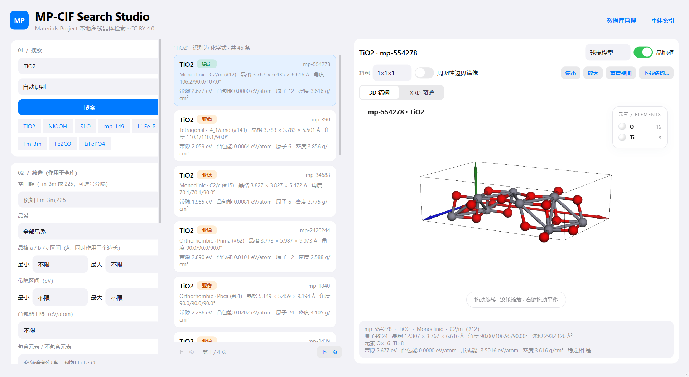
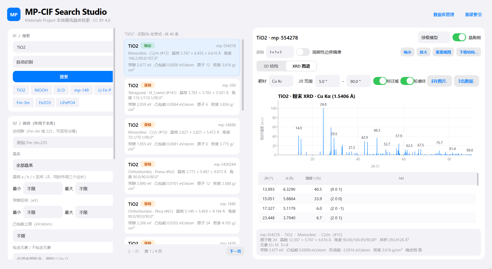

<div align="center">

# 🔬 MP-CIF Search Studio

**Materials Project 本地离线晶体检索器 · 纯本地运行 · 无需 API Key**

把 Materials Project 的公开结构数据镜像到本地，建立 SQLite 索引，然后以图形界面
**离线**检索晶体、查看 3D 结构 / 粉末 XRD、导出 CIF 与 POSCAR。

[](https://www.python.org/)
[](https://pypi.org/project/PySide6/)
[](https://pymatgen.org/)
[](#)
[](LICENSE)
[](https://creativecommons.org/licenses/by/4.0/)
[](https://github.com/moyulyy/MP-cif-database/stargazers)

[**⬇️ 下载数据库**](#-下载数据库推荐) ·
[功能](#-功能) ·
[快速开始](#-从零构建可选) ·
[搜索语法](#-搜索类别详解) ·
[XRD 图谱](#-粉末-xrd-图谱)

</div>

---

## 📸 界面预览

<p align="center">
  
</p>

<p align="center">
  
</p>

> 基于 **Python + PySide6 (Qt 6) + 3Dmol.js + pymatgen**，界面为 iOS 风格浅色设计。
> 数据来源：Materials Project AWS Open Data 公开桶 `materialsproject-build`
> （快照 `collections/2025-09-25`），遵循 **CC BY 4.0**；原始结构版权归 Materials Project 所有。

---

## 📖 目录

- [✨ 功能](#-功能)
- [📦 数据库不随仓库分发](#-数据库不随仓库分发)
- [⬇️ 下载数据库（推荐）](#-下载数据库推荐)
- [🚀 从零构建（可选）](#-从零构建可选)
- [🖥️ 界面布局](#️-界面布局)
- [🔎 搜索类别详解](#-搜索类别详解)
- [📉 粉末 XRD 图谱](#-粉末-xrd-图谱)
- [📁 项目结构](#-项目结构)
- [🗄️ 索引结构](#️-索引结构)
- [🧪 命令行自检](#-命令行自检)
- [⚠️ 说明与边界](#️-说明与边界)
- [📄 许可与致谢](#-许可与致谢)

---

## ✨ 功能

| 能力 | 说明 |
| --- | --- |
| 📥 一键下载数据集 | 从 MP 公共 S3 桶镜像约 1.0 GiB / 3297 个 `jsonl.gz` 分片，断点续传、按字节校验、失败重试 |
| 🗄️ 离线建库 | 流式合并三套集合为 `data/mp_open_data/mp.db`（实测 21.06 万条材料，~484 MiB，建库约 5 分钟） |
| 🔎 多类别检索 | MP-ID、化学式（归一化，`NiOOH ≡ NiHO2`）、元素组合、化学体系、空间群 |
| 🎛️ 全库筛选 | 空间群、晶系、晶格区间、带隙区间、凸包能上限、包含/排除元素、原子数、仅稳定相、仅金属 |
| ↕️ 多种排序 | 稳定性优先、凸包能、带隙升/降、形成能、密度、原子数、体积 |
| 🧊 3D 可视化 | 3Dmol.js 本地渲染，球棍/空间填充/线框/棍状，晶胞框、超胞 1–4×、周期性边界镜像 |
| 🧾 晶体学信息 | 化学式、空间群、晶格常数与角度、体积、密度、带隙、凸包能、形成能、元素组成 |
| 📉 粉末 XRD 图谱 | 按预览结构计算粉末衍射：Cu/Mo/Co/Fe/Cr/Ag 靶切换、自定义 2θ 窗口、峰位标注、轮廓线、峰表，可导出 PNG 与 CSV |
| 💾 结构导出 | CIF 与 VASP POSCAR；下载文件始终是干净的原胞/超胞，不含镜像原子 |
| ⚡ 完全离线 | 建库后可断网使用；运行时不访问任何线上 API |

---

## 📦 数据库不随仓库分发

预构建索引 `mp.db`（约 **484 MiB**）与 MP 原始分片（约 **1.0 GiB**）都 **不会** 提交到
Git 仓库（见 `.gitignore` 中的 `data/`）。克隆仓库后，按下面任一方式准备数据即可。

---

## ⬇️ 下载数据库（推荐）

不想自己从 MP 原始快照重建？直接下载预构建好的 `mp.db`，一次下载后完全离线使用：

<div align="center">

[](https://github.com/moyulyy/MP-cif-database/releases/latest/download/mp.db)

</div>

**命令行下载（推荐，支持断点续传）：**

```powershell
# 1) 创建约定目录
New-Item -ItemType Directory -Force data\mp_open_data | Out-Null

# 2) 下载预构建索引
Invoke-WebRequest -Uri "https://github.com/moyulyy/MP-cif-database/releases/latest/download/mp.db" `
  -OutFile "data/mp_open_data/mp.db" -Resume
```

也可以点击上方按钮用浏览器下载，然后把 `mp.db` 放进 `data/mp_open_data/` 目录。

**校验：**

```powershell
python tools/verify_db.py
```

放好后目录结构应为：

```text
MP-cif-database/
└── data/
    └── mp_open_data/
        └── mp.db      # 预构建 SQLite 索引（约 484 MiB）
```

<details>
<summary><b>维护者：如何把 mp.db 发布成可下载按钮</b></summary>

1. 本地建好库：`python build_index.py` → 生成 `data/mp_open_data/mp.db`。
2. 打开仓库 **Releases → Draft a new release**，新建 tag（例如 `db-2025-09-25`）。
3. 把 `data/mp_open_data/mp.db` 拖入 **Assets** 上传（GitHub 单文件上限 2 GiB，OK）。
4. 发布为 **Latest release** —— README 中的下载按钮即自动生效。
5. 建议同时附上 `sha256` 校验文件与数据快照日期说明。

</details>

---

## 🚀 从零构建（可选）

如果你希望自己从 MP 公开快照重建索引（更慢，但可复现 / 可更新）：

### 1. 安装依赖

已验证环境：Python 3.11、PySide6 6.11、pymatgen 2026.5、numpy 2.4、spglib 2.7。

```powershell
python -m pip install -r requirements.txt
```

> 下文命令均以 `python` 为例；若使用 conda，请换成对应环境的解释器，例如
> `D:\miniconda3\envs\chem_env\python.exe`。

### 2. 下载 MP 原始数据（约 1.0 GiB / 3297 个分片）

```powershell
python fetch_mp_data.py --list-only   # 生成清单
python fetch_mp_data.py --jobs 24     # 下载（可重跑续传）
python fetch_mp_data.py --check       # 校验完整性
```

> 若个别分片因网络抖动卡住，可用并行分块补全器：
> `python tools/recover_missing.py --workers 48`（先 `--list` 查看缺失）。

### 3. 建立本地索引

```powershell
python build_index.py
```

完成后得到 `data/mp_open_data/mp.db`。

### 4. 启动界面

```powershell
python app.py
# 或双击 run.bat
```

> 也可以从界面顶部的 **数据库管理 / 重建索引** 按钮完成数据下载与索引重建。

---

## 🖥️ 界面布局

```text
┌──────────────────────────────────────────────────────────────────────────┐
│  🔬 MP-CIF Search Studio                    [数据库管理] [重建索引]        │
├───────────────┬───────────────────────┬──────────────────────────────────┤
│ 01 搜索       │ 结果卡片列表           │  [球棍模型] [晶胞框 ◉]            │
│ 02 筛选       │  · 化学式 / 稳定标签   │  [超胞][PBC][缩放][下载结构…]      │
│ 03 数据库状态 │  · 空间群 / 晶格       │  [3D 结构][XRD 图谱] 分段标签页   │
│               │  · 带隙 / 凸包能       │                                  │
│               │  上一页 / 下一页       │  晶体学信息（空间群/晶格/能量…）  │
└───────────────┴───────────────────────┴──────────────────────────────────┘
```

界面采用 iOS 风格浅色设计（系统分组背景、圆角卡片、开关控件、分段标签页），
顶部为「大标题 + 蓝色文字按钮」，无菜单栏。

---

## 🔎 搜索类别详解

| 输入示例 | 判定 | 语义 |
| --- | --- | --- |
| `mp-149` | MP-ID | 精确匹配 `material_id` |
| `TiO2`、`NiOOH` | 化学式 | 先按 Hill 归一化键精确匹配，0 命中才退化为模糊 LIKE |
| `Si O`、`Ti,O`、`Ti，O` | 元素组合 | **同时包含**所有列出元素（可再含其它元素） |
| `Ti-O`、`Li-Fe-P` | 化学体系 | 元素按字母序归一化后精确匹配 `chemsys` |
| `Fm-3m`、`225` | 空间群 | 按空间群符号（不区分大小写）或国际编号匹配 |

界面顶部的**类别下拉框**可强制指定解释方式（自动识别 / 化学式 / 元素组合 / 化学体系 /
MP-ID / 空间群），避免歧义。筛选条件与检索条件是 **AND** 关系，且作用于**全库口径**
——结果数、分页都是筛选后的真实总数。

### 归一化化学式

建库与查询共用 `mp_formula.formula_key()`：先约简配比，再按 Hill 系统
（C 首、H 次、其余字母序）排序。

```text
NiOOH  /  NiHO2  /  HNiO2   ->   HNiO2
Ti2O4  /  TiO2              ->   O2Ti
```

---

## 📉 粉末 XRD 图谱

选中材料后，右侧 **3D 结构** 旁边的 **XRD 图谱** 标签页会自动按该结构计算粉末衍射
（基于 pymatgen 的 `XRDCalculator`，将最强峰归一到 `I = 100`）：

- **靶材切换**：Cu / Mo / Co / Fe / Cr / Ag Kα，切换即时重算。
- **2θ 窗口**：任意设置起止角（0.5–150°）。
- **显示选项**：峰位标注、高斯轮廓线（绘图时叠加，不参与计算）。
- **峰表**：逐峰列出 2θ、d 间距、相对强度与 hkl 指数。
- **导出**：`保存图片…` 输出高分辨率 PNG（1600×1000），`导出数据…` 输出含波长/
  窗口元信息与全部峰的 CSV。

> XRD 基于**常规晶胞**计算，与视图中的超胞倍数无关；周期性镜像原子仅用于显示，
> 不会影响衍射结果。

---

## 📁 项目结构

```text
MP-cif-database/
├── app.py               # PySide6 主窗口、搜索 / 筛选 / 结果 / 3D / XRD 交互
├── mp_search.py         # 只读 SQLite 检索层（类别解析、筛选、排序、分页）
├── mp_formula.py        # 化学式 Hill 归一化（建库与查询共用）
├── cif_tools.py         # 结构 dict -> CIF / POSCAR / 信息 / 周期性镜像
├── xrd_tools.py         # 粉末 XRD 计算（pymatgen XRDCalculator）
├── build_index.py       # jsonl.gz -> mp.db 流式 ETL
├── fetch_mp_data.py     # MP Open Data 下载器（清单 / 续传 / 校验）
├── viewer.html          # 本地 3D 页面
├── viewer.js            # 3Dmol.js 渲染逻辑
├── 3Dmol-min.js         # 本地 3Dmol.js（离线渲染）
├── requirements.txt     # 运行依赖
├── run.bat              # Windows 启动脚本
├── LICENSE              # MIT（代码）
├── docs/                # README 截图
├── tests/               # 检索 / 化学式归一化 / CIF / XRD 单元测试
├── tools/
│   ├── verify_db.py     # 建库后一键自检
│   └── recover_missing.py  # 并行分块补全卡住的下载
└── data/mp_open_data/   # 下载数据与 mp.db（已 .gitignore，见「下载数据库」）
```

---

## 🗄️ 索引结构（`mp.db`）

```sql
materials(          -- 摊平所有检索/展示字段
  material_id, formula_pretty, formula_anonymous, chemsys, nelements, nsites,
  volume, density, density_atomic, crystal_system, point_group, sg_symbol, sg_number,
  lat_a, lat_b, lat_c, alpha, beta, gamma,
  band_gap, is_metal, is_gap_direct, magnetic_ordering,
  is_stable, energy_above_hull, formation_energy_per_atom, deprecated)
structures(material_id, z)                 -- zlib 压缩的 pymatgen structure dict
material_elements(material_id, element)    -- 元素包含 / 排除检索
formula_keys(material_id, formula_key)     -- 归一化化学式键
```

---

## 🧪 命令行自检

```powershell
# 一键验证检索类别 / 筛选 / CIF / XRD（建库后运行）
python tools/verify_db.py

# 单元测试（合成小库，不依赖大文件）
python -m unittest discover -s tests -v

# 仅用索引做一次检索（不启动界面）
python -c "import mp_search as s; print(s.search('data/mp_open_data/mp.db','TiO2',size=3))"

# 生成某个材料的 CIF 文本
python -c "import mp_search as s, cif_tools as c; raw=s.get_structure_bytes('data/mp_open_data/mp.db','mp-149'); print(c.cif_bundle(raw)['cif'][:400])"
```

### 实测覆盖（本机）

| 指标 | 数值 |
| --- | --- |
| 材料总数 / 有效 | 210,579 / 200,487 |
| 稳定相 | 34,775 |
| 含热力学数据 | 153,167 |
| 含带隙数据 | 200,487 |
| 不同化学式 / 化学体系 | 155,204 / 76,456 |
| 空间群 / 元素 | 228 / 91 |
| `mp.db` | 507,330,560 B（~484 MiB） |

---

## ⚠️ 说明与边界

- 数据为快照（`2025-09-25`），非实时最新；重新下载 / 建库即可更新。
- **仓库不包含 `data/`**：`mp.db` 请从 GitHub Release 下载（见上），原始分片用 `fetch_mp_data.py` 获取。
- 仅使用经典 `mp-<数字>` 编号体系；未使用 `version=` delta 表中的新式 ID。
- 建库可重复执行（先 `DROP` 再重建），失败直接重跑。
- 含无序 / 部分占据的结构暂不支持生成 CIF（会明确提示）。
- 周期性边界镜像仅用于 3D 显示，**不会**写入下载的 CIF / POSCAR。
- 空间占用：原始分片 ~1.0 GiB + `mp.db` ~484 MiB。
- 3D 视图依赖系统 WebGL；本机桌面环境已验证。
- 建库实测：210,579 条材料，`materials`/`thermo`/`electronic` 三套合并，约 5 分钟。

---

## 📄 许可与致谢

- **代码**：MIT License（见 [LICENSE](LICENSE)）。
- **数据**：来自 [Materials Project](https://materialsproject.org/) 的公开数据集
  （AWS Open Data `materialsproject-build`），遵循 **CC BY 4.0**。原始结构版权归
  Materials Project 所有；使用 / 转载请注明来源。
- 3D 渲染由 [3Dmol.js](https://3dmol.csb.pitt.edu/) 提供；结构解析依赖
  [pymatgen](https://pymatgen.org/)。

<div align="center">

**如果这个项目对你有帮助，欢迎点一个 ⭐ Star！**

</div>
